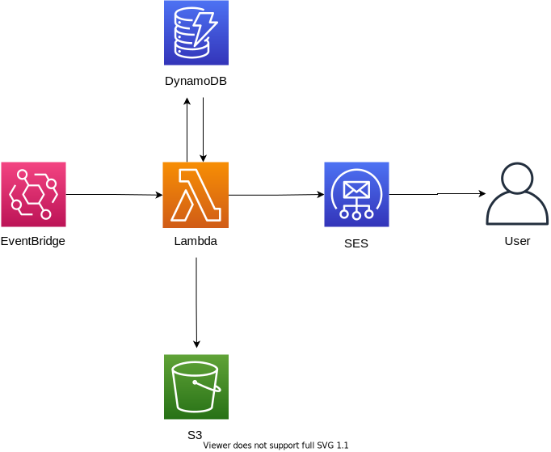

# Zeitung

Zeitung is a serverless application that delivers relevant information via mail on a daily basis, written in Nestjs.

The architecture is based on AWS services. It includes
- Cloudfront
- S3
- Lambda
- SES
- DynamoDB
- API Gateway

This repository addresses all interaction for the Lambda Function (Incoming Requests, DynamoDB queries, SES trigger)